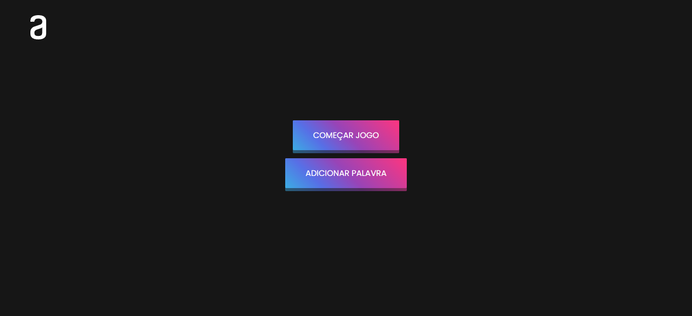
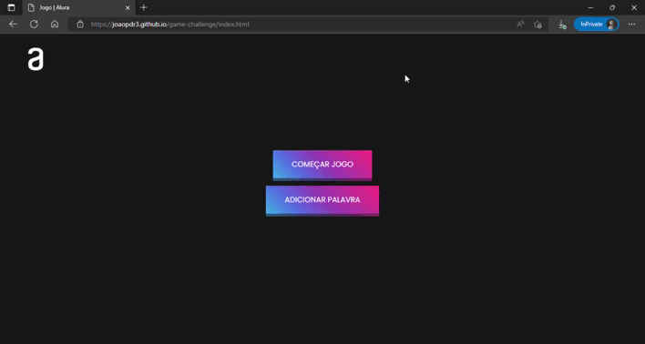

## 📌 Tópicos

- [Sobre](#sobre)
- [Objetivo](#objetivo)
- [Alterações](#alterações)
- [Vizualizar Projeto](#💻-vizualizar-projeto)
- [Vizualizar Funcionamento](#💻-vizualizar-projeto-funcionando)
- [Ferramentas](#🛠️-ferramentas)

## Sobre

Segundo desafio proposto pela Alura em Parceria com Oracle referente ao Programa ONE - Oracle Next Education que disponibilizou uma Formação de Lógica de Programação na Plataforma de cursos da Alura.

Esse segundo e último desafio faz parte dessa Formação de Lógica de Programação que serve para colocar em prática o que foi visto nos cursos.

## Objetivo

O objetivo do projeto consiste em criar um jogo da forca em que o usuário tenha que adivinhar a palavra escolhendo alguma letra.

O jogo dá ao usuário seis tentativas, ao zerar essas tentativas o usuário perde, e adivinhando a palavra ele ganha, sendo possível Recomeçar ou Desistir no jogo.

Por último, uma opção que seja possível adicionar uma nova palavra ao jogo.

## Alterações

1. Troca da Forca por Corações que indicam as tentativas restantes;
2. Palavras com somente 5 letras;
3. Adicionando mais 2 tentativas, no total 8 tentativas;
4. Identificar o teclado do usuário quando pressionado a letra desejada;

## 💻 Vizualizar Projeto

### [🧩 Adivinhe qual é a palavra.](https://joaopdr3.github.io/game-challenge/)

## 💻 Vizualizar Projeto Funcionando

## 🛠️ Ferramentas

- HTML5
- CSS3
- JavaScript
- Logo e Informações retiradas do [🔗 Layout do Desafio.](<https://www.figma.com/file/VmlIMe0bV8m9Zu5StrNJUF/Alura-Challenge---Desafio-2---L%C3%B3gica-(Copy)?node-id=18%3A171>)
- Ícone de Coração retirado do [🔗 Font Awesome.](https://fontawesome.com/)
